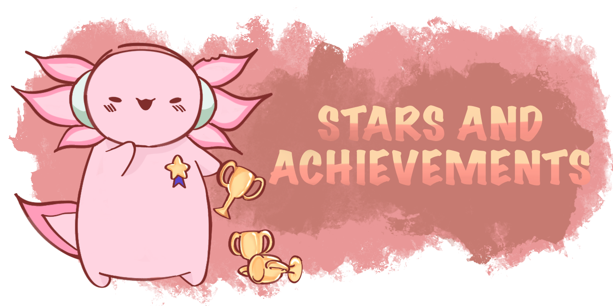

# Stars and Achievements

{align = left}

## <b> Collecting stars </b>

Wen Jun uses a small-scale gamification system in his classes for extra study motivation. Homework assignments must be handed up on time and are graded on a 1 star(:star:), 2 star(:star::star:) or 3 star(:star::star::star:) completion. The total number of stars will be tallied up over the year and the top 3 students will recieve a Math Genius Coin and a hand written letter by me.

## <b> Unlocking achievements </b>

Other than completing homework problems, students can earn stars by unlocking achievements as well. Each achievement can only be unlocked once and will be reflected on the leaderboard. Achievements are split up into Easy (:star:), Medium (:star::star::star:) and Hard (:star::star::star::star::star:) and are worth 1,3,5 stars each respectively.

## <b> Easy Achievements </b>

<b>(:star:) I Say Hi: </b> Goes to the first three people that says hi to me in our math group chat.

<b>(:star:) Nowhere to Hide: </b> Remembered by me for the rest of the year for a unique/positive reason.

<b>(:star:) Gaming is life: </b> Plays any of the video games that I enjoy playing.

<b>(:star:) Blast to the Past: </b> Name me three famous mathematicians and one of the theorems they discovered (can be in person or via text).

<b>(:star:) Help a friend: </b> Use your math skills to help a classmate out with their homework. Achievement only unlocked by referral. Write to me (eg. Friend A helped me with Homework 6 Question 5, then Friend A will get the achievement.)

## <b> Medium Achievements </b>

<b>(:star::star::star:) Full Combo: </b> Get every question correct for a singular homework assignment.

<b>(:star::star::star:) Math Ambassador: </b> Becoming my amazing math rep and doing a good job for the year.

<b>(:star::star::star:) Three star wonder: </b> Get a three star completion for three different homework sets (dont need to be consecutive).

<b>(:star::star::star:) Consistency is key: </b> Achieve a streak of 5 consecutive homework submissions that are on time with at least a one star completion.

<b>(:star::star::star:) Extra credit: </b> Invent an original question along with the solutions on a topic learnt in class and submit it to me (I may even use it as a future homework question!).

<b>(:star::star::star:) Memelord: </b> Invent an funny original math meme about a topic learnt in class that I may use in my slides for future lessons.

## <b> Hard Achievements </b>

<b>(:star::star::star::star::star:) Math Enthusiast: </b> Research about a math topic that's more advanced than our syllabus and volunteer to give a short presentation about it to the class.

<b>(:star::star::star::star::star:) Future Mathematician: </b> Provide a method for a problem in the homework assignment that is unique or better than the model answer.

<b>(:star::star::star::star::star:) Math Genius: </b> Get a perfect score for any graded test or exam.
