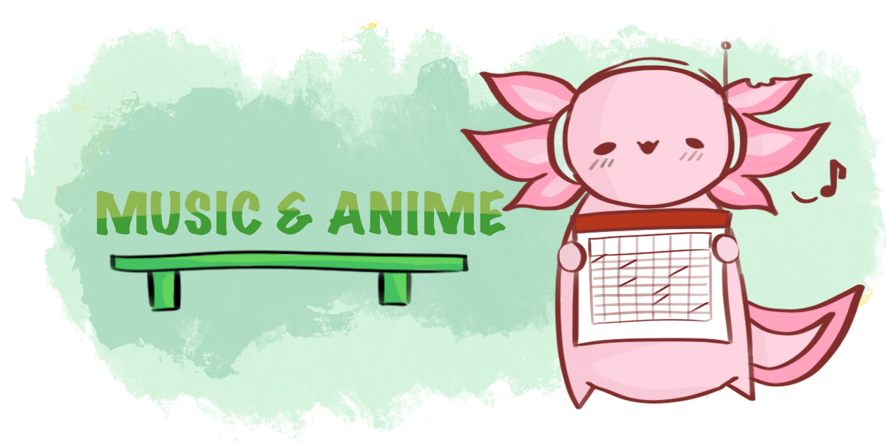

# About me 

Greetings and welcome to my personal website :D My favourite animal is the axolotl, and you will see my mascot, Axie the Axolotl scattered throughout. This is where you can find out more about my passions and interests. And it's also a great way to host my leaderboard for my teaching classes. Hope you will find little snippets of my life, personal projects to my favourite games and music when browsing through.

## <b> Teaching experience </b>

{align = left}

<i> 
:octicons-dot-fill-16: [A Math Complete Guide Youtube video (2023) Click to view!](https://youtu.be/tWSbQ-FF3Kg)

:octicons-dot-fill-16: Programming Instructor, SGCodeCampus (2021-2023)

:octicons-dot-fill-16: Teaching Intern, Anglican High School (Summer 2021 and 2022)

:octicons-dot-fill-16: Freelance math tutor (2020) </i> 

I first picked up teaching while in university as a side hustle and also because I really enjoy talking and explaining stuff, partially also because I am quite an extrovert. One of the main reasons why I enjoy teaching is to be able to create content and unique experiences for my students. I also realised I really enjoyed being in a school environment after teaching A-math in Anglican High during my summer vacation in university. I still remembered my first ever form class wrote me a big card before I left and it has given me so much encouragement through tough times, thank you 4H <3

I decided to just try my luck and applied to MOE to become a full-time teacher. They got back to me with an offer, and I felt stuck in a dilemma about choosing between working in engineering or to pursue teaching. But after reflecting on all the amazing memories and the joy I felt while teaching, I felt that it was the right choice for me. I prayed about it and decided to full commit and hopefully never look back. I’d like to sum up my teaching philosophy in one sentence: “Before I am a teacher, I will be a forever student. Never stop learning.”

## <b> Education </b>

{align = left}

<i>:octicons-dot-fill-16: B.Eng, Mechanical Engineering with minor in Artificial Intelligence, NUS (2023) 

:octicons-dot-fill-16: Diploma in Aeronautical Engineering, Singapore Polytechnic (2018)</i>

After graduating from secondary school, I went into engineering because I enjoyed studying Math and Physics, and airplanes looked cool at that time. Even though I sort of enjoyed studying engineering in polytechnic and university, I couldn’t really foresee myself working as an engineer. While in my first year in NUS, I started to get more and more interested in machine learning and AI and eventually took up a minor in it. 

The main fields of AI research that really interest me are in Natural Language Processing (NLP) and game playing agents. I remember spending full days on end trying to code out a chess-playing AI using an enhanced version of the [Minimax algorithm](https://www.geeksforgeeks.org/minimax-algorithm-in-game-theory-set-1-introduction/) for an assignment, and it’s probably one of my proudest accomplishments when I managed to get it to work. I eventually did a final year project on an AI-based aircon system to achieve thermal comfort.

Even though I already commited to being a teacher, I still enjoy studying and keeping up to date with AI research, seeing how fast new technologies are emerging. Maybe in a parallel universe I would have become an AI researcher instead.

## <b> Music and Anime </b>

{align = left}

<i>:octicons-dot-fill-16: 2000's Emo pop and Rock music </i>

Rock and pop music has always been my go to music of choice growing up. Artists like Avril Lavigne, Panic! at the Disco, Linkin Park and My Chemical Romance are some of my favourites. It's also one of the reasons why I picked up learning the guitar a few years back.

<i>:octicons-dot-fill-16: Electronic and Dance music </i>

One of my favourite EDM artists is Porter Robinson. I was so inspired to get back into playing and making music after watching [his concert](https://youtu.be/THjekE5p2aw) when he came to Singapore in 2023. His newest album 'Nurture' is probably my favourite album so far on spotify and I love almost every song in that album.

<i>:octicons-dot-fill-16: Anime Music & J-Pop </i>

[Your Name](https://myanimelist.net/anime/32281/Kimi_no_Na_wa) was probably my favourite anime movie in my life. The animation and soundtrack was so amazing the first time and it blew my mind the first time I watched it. I even got motivated enough to try to learn a few of their songs on the piano even though I quit learning piano many many years ago.

## <b> Video Games </b>

{align = left}

Despite spending way too many hours playing video games growing up, gaming has been such an instrumental part of my life. So much so that one of my initial dream jobs was to be a gaming YouTuber. These were the games I spent a significant time playing while growing and has shaped who I am today.

<i>:octicons-dot-fill-16: Maplestory (MMORPG): </i>

I remember when I was Primary 2, our family managed to get a first computer and all my classmates were talking about the new hottest game back then, Maplestory. I remember not being able to sleep while Maplestory took 8 hours to download on my computer overnight. The graphics and soundtrack were so amazing and levelling up my character to grow stronger was so satisfying. I was instantly hooked. The idea of being able to play with my friends in realtime was so crazy to me. I still get nostalgic everytime I listen to the Maplestory soundtrack, and some of my best memories gaming came from this.

<i>:octicons-dot-fill-16: Pokemon Emerald & Platinum (RPG): </i>

All the cool kids in my school owned a Gameboy at that time and I begged my mom to get me one as well. After lots of persuading, I got one and a fresh copy of Pokemon Emerald. Playing through the game felt like I was going on an adventure, and it was an actually quite challenging (at least for 10 year old me), which made beating it even more satisfying. It was also at this age where I found out YouTube was the best teacher, thank you [Marriland](https://www.youtube.com/channel/UCe2yn-ptTl529JPheQgzm_A) for all your Pokemon video walkthroughs, it helped me so much.

<i>:octicons-dot-fill-16: Blackshot (FPS): </i>

My first experience in the world of first-person shooters genre, again it was the most popular game in the school when I was around Primary 6. This was also my first introduction to the world of ‘competitive’ games, coming with the thrill of winning and the sad losses. It was very different to Maplestory as you don’t get better as you level up your character, but its through your skill and improving your gameplay and strategy. And I realised I really enjoyed the process of getting better and winning alongside my friends.

<i>:octicons-dot-fill-16: Minecraft (Sandbox): </i>

I would not have imagined this game blew up as much as it did over the years. I remember begging my mom to buy me the PC version when it first came out back in 2010. Looking back, exploring the world the first time I played was such a novel experience. Minecraft was also my creative outlet to build and create whatever I wanted, features like Redstone and Command blocks proved to be such a foundation for my engineering education. I remember making a custom map that ended up getting sort of famous (a few big Youtubers played it) and ran a Minecraft server with some of my friends after my O levels. My best memories in Minecraft were shared experiences with my friends. I still follow and watch [Minecraft Championship (MCC)](https://mcc.live/) due to many of my favourite content creators playing regularly in the event.

<i>:octicons-dot-fill-16: Team Fortress 2 (FPS): </i>

This was around the time when I was in secondary school when the Steam hype took over and the TF2 was one of the coolest free-to-play games out there. Contrary to Blackshot, it felt so much more dynamic and vibrant due to the artstyle and community. TF2 also offered so much more variety in weapons and mechanics as compared to Blackshot. Looking back, I’m really sad that TF2 ended up being abandoned by Valve since it had so much potential as a casual and competitive game.

<i>:octicons-dot-fill-16: Dota 2 (MOBA): </i>

Ah yes, the game I spent more hours playing than I would like to admit. Doing a quick check on Steam, I have accumulated over 5000 hours of playtime in my life. I probably could have gotten a PHD with that amount of time spent playing over my life. It's such a complicated game to learn with so many heroes and abilities but I guess that was the joy of it, exploring and getting better. I probably spent a significant amount of time looking up guides and YouTube videos trying to learn different tips and tricks as well. Probably not the fondest memory of this game due to the toxic community and rage inducing games but I still play it from time to time when my friends invite me.

<i>:octicons-dot-fill-16: Valorant (FPS): </i>

At first glance, I thought Valorant would be what TF2 could only dream of being - having actual developmental team that listens to their players. Even though I love the characters and the aesthetic of the game, I didn’t really like the round-based ‘die once and not respawn’ type of gameplay which is similar to CS. However, its really fun to play together with my friends, and I really enjoyed the friendships and talking about life over a game of Valorant. Yes, I am a jett main because dash go woosh.

<i>:octicons-dot-fill-16: Genshin Impact (RPG): </i>

The amount of marketing this game had when it first launched was crazy, the artstyle, world building and characters seemed so cool. As much as I loved the combat mechanics and world exploration, I hated reading through long chunks of text and sitting through long-winded story quests. Similar to Valorant, just based on the sheer number of people that know about Genshin, its always a common topic that comes up when I talk to new people. I always enjoy the feeling of levelling up your characters and getting better artifacts and weapons for them to do more damage. And also wishing, ah yes, primogems is life.
